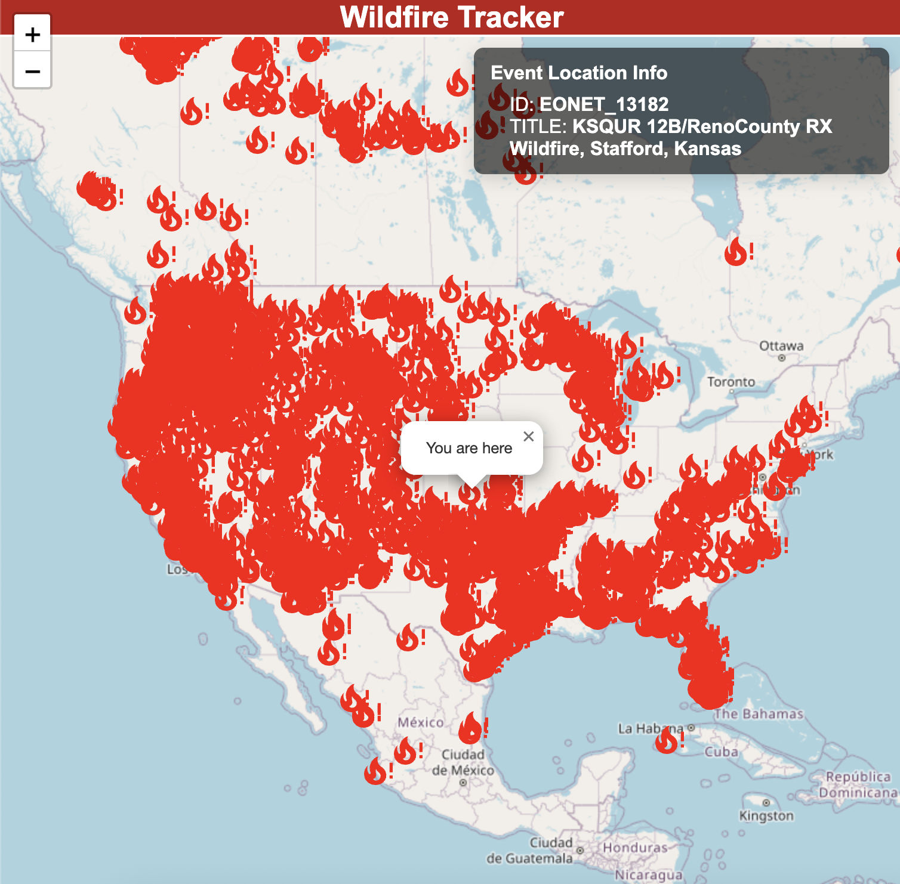

# Wildfire Tracker
A React web application that visualizes real-time wildfire data from NASA's EONET API on an interactive world map.

## Overview
This project fetches live natural event data from NASA's Earth Observatory Natural Event Tracker (EONET) API and displays active wildfires on an interactive map. I built it to learn React hooks, API integration, and working with mapping libraries. The app filters events by category ID 8 (wildfires), plots them as fire markers on an OpenStreetMap base layer using Leaflet, and displays event details in an info box when a marker is clicked.

Along the way I ran into some bugs around asynchronous data fetching due to the handling of empty state render before the API call resolved. I fixed this by adding loading flag tied to useEffect.

## Features
- **Real-Time Data** – Fetches current wildfire events from NASA's EONET API 
- **Interactive Map** – Built with React-Leaflet and OpenStreetMap tiles for smooth panning and zooming
- **Fire Markers** – Custom fire alert icons mark each wildfire location using coordinates from the API
- **Click for Details** – Clicking a marker displays an info box showing the event ID and title
- **Loading State** – Shows a loading screen while fetching data from the API

## Technologies Used
- React.js (with Hooks: useState, useEffect)
- React-Leaflet
- Leaflet
- OpenStreetMap
- NASA EONET API
- CSS

## How to Run
```bash
npm install
npm run dev
```

## What I Learned
This project taught me how to use React hooks for state management and side effects, integrate third-party APIs, work with the React-Leaflet mapping library, and handle asynchronous data fetching with loading states.

## Screenshot

